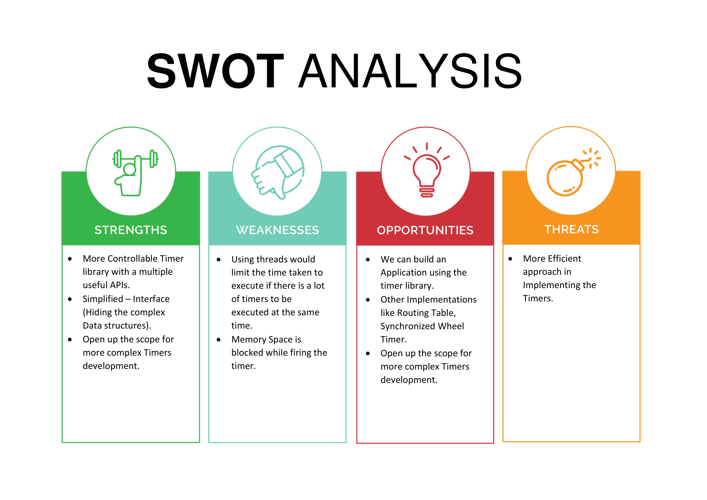

# Requirements
## Introduction
 ### Why do we need TIMERS?
  * TIMERS help in scheduling the events to be triggered or fired in a software or an application in future for ONE SHOT or PERIODICALLY.
  * TIMERS  are extensively used in many domains of Computer Science, expecially in Networking. Some of the examples are, 
    #### TCP Timers.
     * Timer for scheduling an acknowledgement packet.
     * Timer to run its Back-off Algorithm.
    #### OTP Time Outs.
    #### Session Log Out.
    #### Periodically sending out Network Packets.
    #### Defining/ Scheduling the computation.
  * One of the most common programming concept that you would come across is TIMERS.
 ### Types of TIMERS
  #### 1. ONE SHOT TIMERS
   * These are used when a Application needs to do some work only once in future.
   * They are triggered only once.
   * For Example, Delete X after 10 sec.
  #### 2. PERIODIC TIMERS
   * These are used when a Application needs to do some work periodically at regular intervals.
   * They are triggered at regular intervals.
   * For Example, Send HELLO at an interval of 5 sec for 100 sec.
  #### 3. EXPONENTIAL BACKOFF TIMERS
   * It is a special case of periodic timers.
   * They are triggered at exponentially placed temporal points.
   * Send re-entry event at t = 1, t = 2, t = 4, t = 8, t = 16, ..... so on.
   * Used in protocols such as TCP.
   
 LINUX Enabled APIs will provide us the basic foundations regarding how to implement a TIMER and then we will build up from there to design the TIMER library which will give the developer full control over timers.
 We will study about LINUX inbuilt POSIX compliant TIMER APIs and build our own custom more controllable TIMER Library on top of those.
 We will be implementing all the three types of TIMERS mentioned above.

## Research
 POSIX provides four basic APIs to manipulate timers on UNIX compliance platforms.
 
 * timer_create() -> Create a TIMER data structure(But do not fire it).
 * timer_settime() -> Used to start/stop the timers depending on the arguments.
 * timer_gettime() -> Returns the time remaining for the timer to fire.
 * timer_delete() -> Delete the TIMER data structure.
 
 We will be using the above 4 APIs as building blocks to build our own custom TIMER Library.
 
 Detailed Report is given here -> [Research](Research_Timers.pdf)

## Defining the system
 ### Timer States
  * Crete a Timer, timer_create() - TIMER_INIT state(Disalarmed Timer)
  * Running the Timer, timer_settime() - TIMER_RUNNING state
  * Doesn't delete/ free up the internal data structure or memory occupied by the Timer - TIMER_CANCELLED state
  * Permanently delete the Timer - TIMER_DELETED state
  * Pause the Timer - TIMER_PAUSED state
  * Resume the Timer - TIMER_RESUMED state

 * From any state, Timer can go to TIMER_DELETED state.
 * Once in TIMER_DELETED state, Timer must be destroyed, it cannot be reused again.
 * When Timer moves across states, we need to update certain properties tracking variables of the Timer.

## Features
Our TIMER library would allows us to do : 
 * PAUSE, CANCEL, RESUME, DELETE, RESTART, RESCHEDULE, BACK-OFF TIMER.
 * Simplified - Interface(Hiding the complex Data structures).
 * Open up the scope for more complex Timers development.

## Cost
The Library will be free of cost and will be available for all the people who wants to use the functions. But, in case, if someone wants to develop an application based on the library, where they will be requiring the functionality of the functions, we will be charging cost based on the requirement and ownership of the application.

## SWOT Analysis

# 4W&#39;s and 1&#39;H

## Who:
* Any Software developer who wants to use TIMERS in their application or in their project.

## What:
* It's a custom more controllable TIMER Library which will give the developer full control over timers.

## When:
* If any Software developer wants to use TIMERS in their application or in their project.

## Where:
* The Library will be available on GITHUB.

## How:
* Proper Documentation will be provided regarding the usage of APIs present in our Library. It will be available in the GITHUB.

## Detailed Requirements
### High Level Requirements
|      ID          |Description                          |Status                         |
|----------------|-------------------------------|-----------------------------|
|HR_01|PAUSE Timer|Implemented|
|HR_02|RESUME Timer|Implemented|
|HR_03|RESTART Timer|Implemented|
|HR_04|RESCHEDULE Timer|Implemented|
|HR_05|DELETE Timer|Implemented|
|HR_06|CANCEL Timer|Implemented|
|HR_07|Get Remaining Time|Implemented|
|HR_08|Print Timer State|Implemented|
|HR_09|Routing Table|Future|
|HR_10|Synchronised Wheel Timer|Future|

### Low Level Requirements
|      ID          |Description                          |  HLR_ID  |Status               |
|----------------|-------------------------------|----------|-----------------------------|
|LR_01|timer_get_current_state() API|HR_01|Implemented|
|LR_02|timer_get_remaining_time() API|HR_01|Implemented|
|LR_03|resurrect_timer() API|HR_01|Implemented|
|LR_04|timer_set_state() API|HR_01|Implemented|
|LR_05|timer_get_current_state() API|HR_02|Implemented|
|LR_06|timer_fill_itimerspec() API|HR_02|Implemented|
|LR_07|resurrect_timer() API|HR_02|Implemented|
|LR_08|timer_set_state() API|HR_02|Implemented|
|LR_09|cancel_timer() API|HR_03|Implemented|
|LR_10|timer_fill_itimerspec() API|HR_03|Implemented|
|LR_11|resurrect_timer() API|HR_03|Implemented|
|LR_12|timer_set_state() API|HR_03|Implemented|
|LR_13|timer_get_current_state() API|HR_04|Implemented|
|LR_14|cancel_timer() API|HR_04|Implemented|
|LR_15|timer_fill_itimerspec() API|HR_04|Implemented|
|LR_16|resurrect_timer() API|HR_04|Implemented|
|LR_17|timer_set_state() API|HR_04|Implemented|
|LR_18|timer_delete() API|HR_05|Implemented|
|LR_19|timer_set_state() API|HR_05|Implemented|
|LR_20|timer_get_current_state() API|HR_06|Implemented|
|LR_21|timer_fill_itimerspec() API|HR_06|Implemented|
|LR_22|resurrect_timer() API|HR_06|Implemented|
|LR_23|timer_set_state() API|HR_06|Implemented|
|LR_24|timer_state() API|HR_07|Implemented|
|LR_25|timer_get_time() API|HR_07|Implemented|
|LR_26|timer_get_time() API|HR_08|Implemented|
|LR_27|timer_get_current_state() API|HR_08|Implemented|
